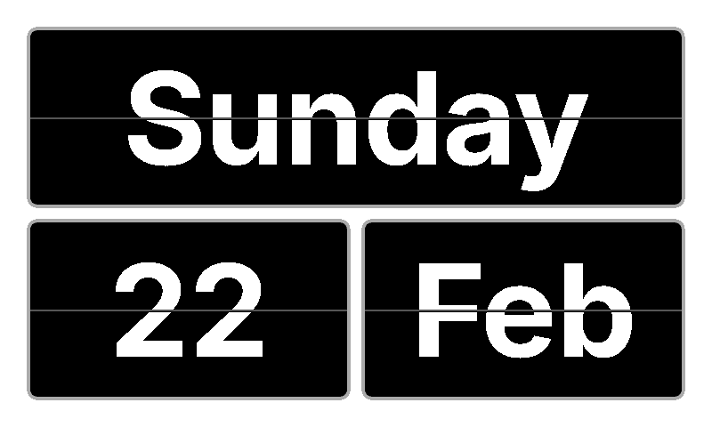

# trmnl-flip-date

A retro inspired flip date clock, with internationalisation support. Built for the TRMNL device.

## Setup

1. `brew install rbenv`
2. `brew install firefox@nightly`
3. `brew install ImageMagick`
4. `rbenv init`
5. `rbenv local`
6. `bundler install`
7. `npm install`
8. `npx playwright install`
9. `APP_ENV=production trmnlp serve`

## Pushing changes to TRMNL

1. `trmnlp login`
2. `trmnlp push`
